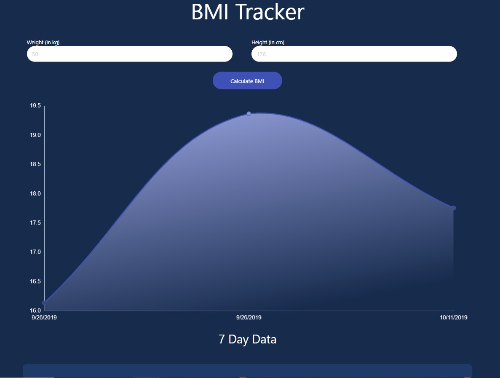

## BMI Calculator

[](https://travis-ci.com/GermaVinsmoke/bmi-calculator)
[](https://coveralls.io/github/GermaVinsmoke/bmi-calculator?branch=master)
[](https://codecov.io/gh/GermaVinsmoke/bmi-calculator)

## Overview

**BMI Calculator** is a React Hooks-based app that calculates the Body Mass Index (BMI) of a person based on their height and weight. The app stores BMI data for up to 7 days using LocalStorage, which allows users to track their BMI history over a short period.

The project was bootstrapped using _create-react-app_ and is intended to demonstrate the use of React Hooks, state management, and local storage. It can be used as a simple, lightweight health monitoring tool or as a base for more complex health-related projects.

See the [full create-react-app guide](https://github.com/facebookincubator/create-react-app/blob/master/packages/react-scripts/template/README.md).



## Table of Contents
- [Overview]
- [Installation]
- [Usage]
- [Contributing]
- [Enhancements]


## Installation

To set up the project locally, follow these steps:

1. Clone the repository:
   ```bash
   git clone https://github.com/GermaVinsmoke/bmi-calculator.git

2. Navigate into the project directory:
   ```bash
   cd bmi-calculator

3. Install the dependencies:
   ```bash
   npm install

4. Run the initial build (only required the first time):
   ```bash
   npm run build


## Usage
1. Start the application:
   ```bash
   npm start

2. Open the http://localhost:3000 link to view the app

## Contributing

We welcome contributions to improve the BMI Calculator app as it is an Open Source Project! If you'd like to contribute, follow these steps:

1. **Fork the repository** on GitHub by clicking the "Fork" button in the top-right corner.
2. **Clone your fork** to your local machine using the steps provided in the installation section.
3. **Create a new branch** for your feature/bug fix.
4. Make your changes and **commit** them.
5. **Push the branch** to your fork.
6. **Submit a Pull Request** to the original repository.


## Enhancements

1. Removing the dependency of Materialize-CSS module
2. ~~Chart going crazy on hovering over the old points~~

